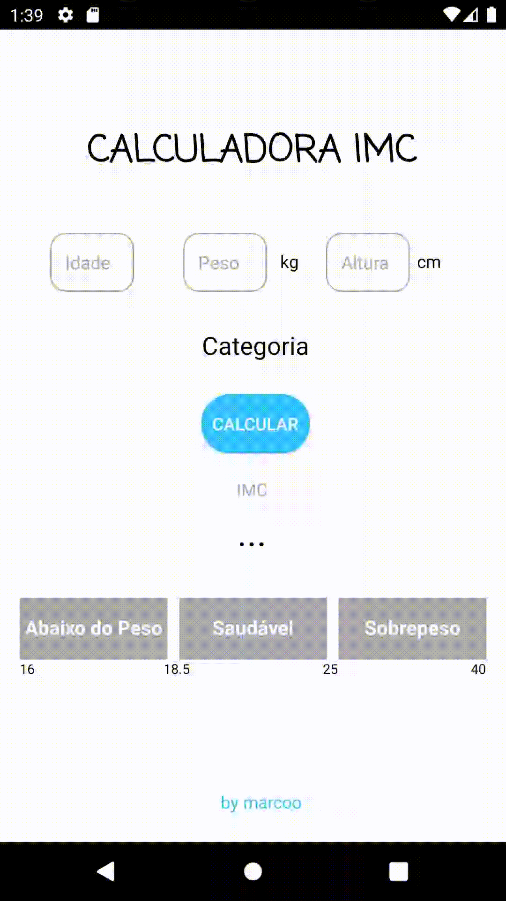

<h1> Progamação Mobile 1</h1>
📱 Apps desenvolvidos no Android Studio com Java,XML durante a Disciplina de Progamação Mobile 1 do Curso de ADS.

  <h2>Exercícios 01</h2>
  

    
    
    
  

  <h2>Exercícios 02</h2>
  

    
    
  

<h2>Exercício 03</h2>
  

    
  

  <h2>Exercícios 04</h2>
  

    
    
  

  <h2>Exercício 05</h2>
  

    
  

  <h2>Exercício 06</h2>
  

    
  

  <h2>Exercício 07</h2>
  

    
  

